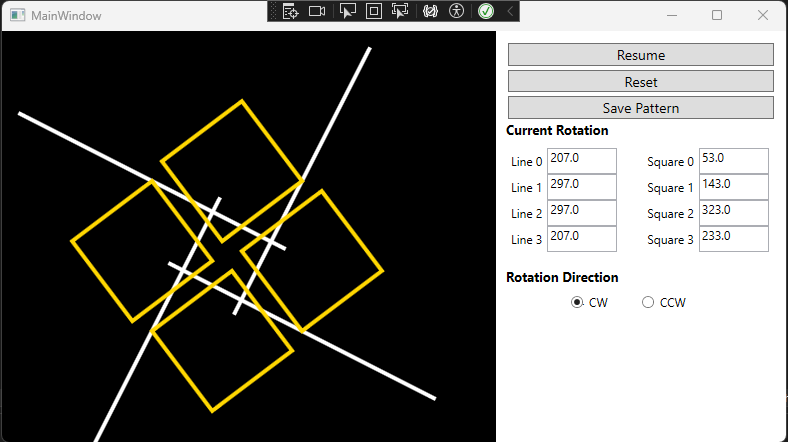

# Kinetic Art Simulator

A simple kinetic art simulator that creates geometric patterns using 4 rotating squares and 4 rotating lines.

---

### Features
- 4 independently rotating squares
- 4 independently rotating lines
- Adjustable rotation angles
- Clockwise / counterclockwise rotation
- Pause and resume animation
- Reset rotation values
- Save patterns as JSON files

### How to Use
1. Set the rotation values for each square and line.
2. Choose the rotation direction.
3. Click Resume to start the animation.
4. Click Save Pattern to save the current rotation parameters as a JSON file.

### Future Updates
- Read and load saved patterns from JSON files
- Motor motion control for physical kinetic art

...More features will be added as the project develops!	
